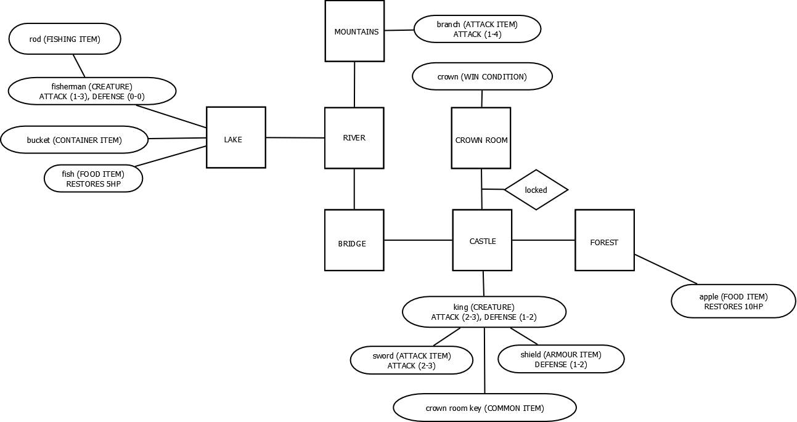

# Zork

My personal version of the Zork game.

Here is the map of this version for anyone who would like to play, the starting position is the MOUNTAINS and in order to **WIN**, the player should reach the Crown Room, take the crown and equip it.

The BASIC commands that can be performed are the following ones:
* **look** (something): Get the description of something
* **go** (direction): Go to that room (if possible)
* **inventory**: Check your current items
* **stats**: Check your health, attack and defense values
* **take/grab** (something): Collect something from the room and drop it in your inventory
* **take/grab** (something) **from** (container): Collect something that is inside a container
* **drop/throw** (something): Get something from your inventory and drop it to the floor of the room
* **drop/trow** (something) **into** (container): Throw an item inside a container
* **equip/unequip** (equipable item): Equip or unequip an item as your weapon or armour
* **examine** (creature): Check the stats and the inventory of an NPC
* **loot** (creture): Collect the inventory of an NPC if its dead

And the UNIQUE features implemented are:
* **attack** (creture): Start a fight against an NPC (real-time battle)
* **lock/unlock** (exit) **with** (key item): Lock or unlock a certain exit with its corresponding key
* **fish** (item) **with** (rod): A fish from the lake will be added to the inventory, but the rod will break
* **eat** (food): Consume a food item to gain health
-------------------------------------------------------------------
* Weapons and NPCs have attack and defense values like in the RPGs
* Consumable items have been added around the map (fish and apple)

I think that what made me struggle the most was the use of the pointers, because I am not really used to it yet and the application of polymorphism, because I did not find a lot of situacions in which I could apply it.

And for my unique feature, I not only wanted to have realistic RPG battles with stats and the ability to lock and unlock doors with keys, but also wanted to add something special, so I did a fishing system (simple, but that can be more complex with probability to fish, more rods...) and eating items that can be consumed to increase the player's HP.

That is all, enjoy! ~Mark
